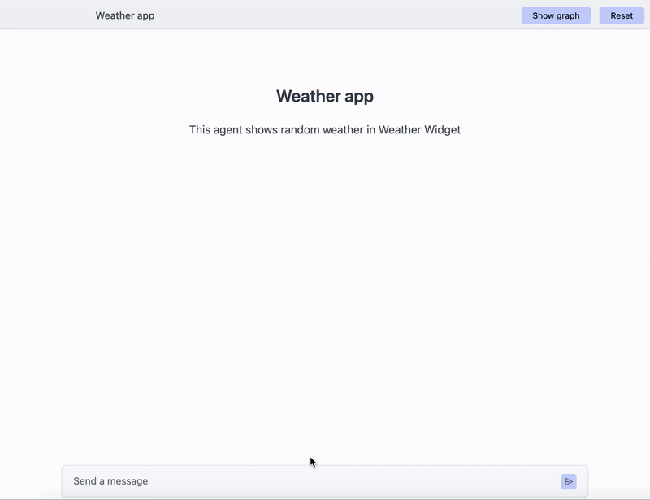
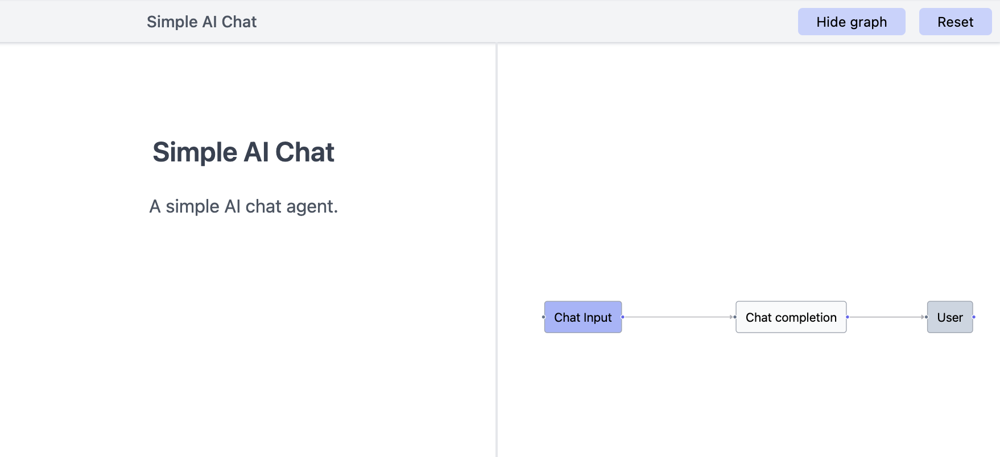

<p align="center">
  <a href="https://useportal.ai/" target="_blank" rel="noopener noreferrer">
    
  </a>
</p>
<br/>
<p align="center">
  <a href="https://x.com/reagent_ai"></a>
  <a href="https://npmjs.com/package/@reagentai/reagent"></a>
  
</p>

# Reagent

> Graph based AI agent framework

Reagent is an open-source Javascript framework to build AI agents. It allows you to build AI agents with multi-step workflows by combining nodes into an agent graph.

It supports rendering custom UI components directly from the workflow nodes and seamlessly integrates with any frontend frameworks like NextJs, Remix, Solid-start, Svelte Kit, etc.

## Demo



## Features

- **Auto generate workflow graph**: Generate the agent graph automatically
- **Supports Any AI Model**: Use OpenAI, Anthropic, Mistral, Groq or any other model provider
- **Framework Agnostic**: Works with any modern JavaScript framework: React, Solid, Svelte and Vue
- **Easy Integration**: Easily integrate into your existing application
- **Full type safety**: It is written in Typescript and supoprts type inference when building an agent graph

## Use cases

- **AI Chat**: Build custom AI chat applications
- **Workflows**: Easily build custom AI powered workflows
- **AI Agent**: Build custom AI agents with backend/frontend `tool` calling

## Getting Started

### Installation

```bash
npm install @reagentai/reagent @reagentai/cli
```

### Example: Simple chat application

Here's a very simple AI chat application.

```typescript
import 'dotenv/config'; 
import { GraphAgent } from "@reagentai/reagent/agent";
import {
  ChatCompletion,
  ChatInput,
  User,
} from "@reagentai/reagent/agent/nodes";
import { Groq } from "@reagentai/reagent/llm/integrations/models";
import { DummyModel } from "@reagentai/reagent/llm/models/dummy";

// create a new agent
const agent = new GraphAgent({
  name: "Simple AI Chat",
  description: "A simple AI chat agent.",
});

// add an input node; each agent must have an input node and user node for final output
const input = agent.addNode("input", new ChatInput());

// add a chat completion node
const chat1 = agent.addNode("chat-1", new ChatCompletion(), {
  config: {
    systemPrompt: "You are an amazing AI assistant called Jarvis",
    temperature: 0.9,
    stream: true,
  },
});

// add user node; this is a mandatory node for output
const user = agent.addNode("user", new User());

// bind chat completion node's inputs
chat1.bind({
  // TODO: replace model with an actual model
  model: new Groq({ model: "llama3-8b-8192" }),
  query: input.output.query,
});

// bind user node's inputs
user.bind({
  markdown: chat1.output.markdown,
  markdownStream: chat1.output.stream,
});

// export agent as default to run this agent with reagentai cli
export default agent;
export const nodes = [];
export const __reagentai_exports__ = true;
```

To run this chat agent, copy the above code to a `agent.ts`, rename `.env.example` to `.env`, add your API key, and run the following command:

```bash
pnpm reagent dev agent.ts
```

The following agent graph is auto generated for the above chat agent:



## LICENSE

[MIT](LICENSE)
