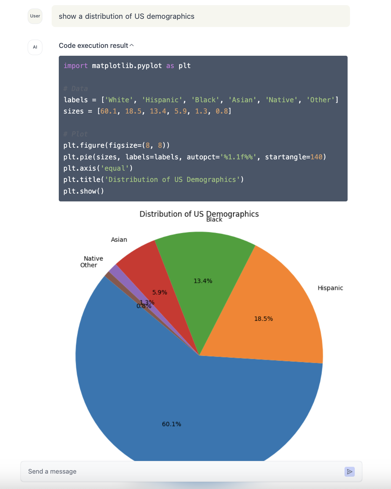

## Integrating Reagent with Next.js

This guide provides detailed instructions to integrate AI agent/workflow built using Reagent into your existing Next.js application. This example uses an example AI agent but you will probably want to build your own AI agent/workflow for your use case.

### Installation

First, you need to install the following `npm` packages.

```bash
pnpm install @reagentai/reagent @reagentai/react
```

Install `@reagentai/react-examples` package to use an example agent. You can skip this if you already have a custom agent.

```bash
pnpm install @reagentai/react-examples
```

### Next.js config

Update your `Next.js` config to add a `webpack` loader. Reagent AI agent/workflow needs to be compiled differently for frontend and backend. This ensures that only the UI components rendered by your workflow are included in the frontend bundle and rest of the agent workflow code stays only in the server bundle.

```javascript
// next.config.js
export default {
  webpack: (config, { isServer }) => {
    config.module.rules.push({
      test: /\.+(js|jsx|mjs|cjs|ts|tsx)$/,
      use: [
        {
          loader: "@reagentai/reagent/dev/webpack/index.js",
          options: {
            ssr: isServer,
            include: ["**/@reagentai/**"],
            exclude: ["**/node_modules/**"],
          },
        },
      ],
    });
    return config;
  },
};
```

### Setup UI

In this example, we will add an AI chatbot to our `Next.js` application. Create a new directory called `chat` under root `app` directory. Then add a file `page.tsx` and paste the following code.

Some of the Reagent React components can only be used on `client` side rendering. So, don't forget to add `"use client"` at the top of the file.

For this example, we are using a data analysis agent built using `E2B` code interpreter. So, we need to import the agent from `"@reagentai/react-examples/e2b"`.

```typescript
"use client";
import { ReagentChat, createChatStore } from "@reagentai/react/chat";
import { ReagentContextProvider } from "@reagentai/react/agent";
import * as agent from "@reagentai/react-examples/e2b";

const ChatAgent = () => {
  const store = createChatStore(
    {
      messages: {},
      invokeUrl: "/api/chat/invoke",
      async onInvokeError(res) {
        // TODO: show error
      },
    },
    {
      persistKey: `reagent-chat-state`,
    }
  );

  return (
    <div className="h-full">
      <ReagentContextProvider nodes={agent.nodes || []}>
        <ReagentChat store={store} />
      </ReagentContextProvider>
    </div>
  );
};

export default ChatAgent;
```

#### Styling

Reagent React components use `tailwind` for styling. You need to setup `tailwind` for your `Next.js` application if it's not already setup.

### Setup API route

Now, lets add an API route for our agent. Add a file named `route.ts` under `app/api/chat` directory and paste the following code. Please make sure that you are using the same AI agent in the frontend and the backend. In this example, we are using `@reagentai/react-examples/e2b`.

```typescript
// app/api/chat/route.ts

import { z } from "@reagentai/reagent/agent";
import { OpenAI } from "@reagentai/reagent/llm/integrations/models";
import { invokeGraphAgent } from "@reagentai/serve";
import agent from "@reagentai/react-examples/e2b";

const invokeSchema = z.object({
  input: z.object({
    id: z.string(),
    message: z.object({
      content: z.string(),
    }),
    model: z
      .object({
        provider: z.enum(["openai", "anthropic", "groq"]),
        name: z.string(),
      })
      .optional(),
  }),
});

export async function POST(request: Request) {
  const { input } = invokeSchema.parse(await request.json());
  const model = new OpenAI({
    model: "gpt-3.5-turbo",
  });

  const agentOutputStream = invokeGraphAgent<any>(agent, {
    nodeId: "input",
    input: {
      query: input.message.content,
      model,
    },
  });
  return agentOutputStream.toResponse();
}
```

### Start your application

Now, start your `Next.js` application using `pnpm next dev` and open `http://localhost:3000` to chat with your agent.

To see `E2B` code intrepreter in action, you can ask AI to: `show a distribution of US demographics`

### Screenshot

<p align="center">
  
</p>

### TODO

[ ] Visualize agent graph
[ ] Chat history
